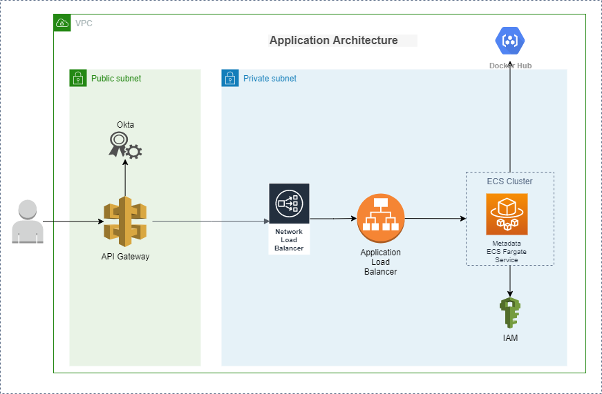

# AWS API Gateway - Private ALB Integration
This project includes following:
- Public endpoints exposed using AWS API Gateway
- Lambda authorizer to validate access using Okta
- Spring Boot application for API endpoints
- Spring Boot application is deployed in ECS Fargate cluster which is behind the ALB
- AWS API Gateway route the request to ALB using NLB (with VPC Link)

### Architecture


### Build
###### Build application and create local image
```
mvn clean package dockerfile:build
```

###### Build application and push image to remote repository
```
mvn clean package dockerfile:push
```

### Run
###### Local
Metadata Service
Refer run config in [this](.run) folder.

###### Postman Collections
Use the Postman Collections & Environments in [this](/postman) folder.

###### H2 Console
Go to [this](http://localhost:8080/api/v1/metadata/h2-console) link.

###### docker compose
```
docker-compose up -d

docker-compose ps

docker-compose down

docker-compose logs -f --tail="all"
docker-compose logs -f --tail="100"

docker-compose logs -f --tail="all" metadata
```
